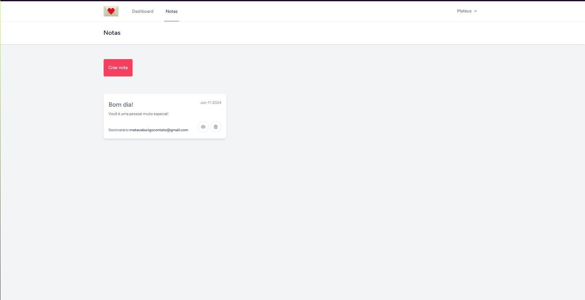

# SendNotes

> Projeto desenvolvido para estudos e prática em Laravel, Livewire e Filament.

## 🚀 Tecnologias
- Laravel
- Livewire
- Filament
- WireUI
- MySQL

## 💻 Projeto

O projeto consiste em envio de notas para quem você quiser, com envio automático para o email do destinatário e um painel administrador amigável feito pelo [Filament](https://filamentphp.com).
 
 
Vídeo do projeto funcionando abaixo 👇

## 📝 Licença

Esse projeto está sob licença. Veja o arquivo [LICENÇA](LICENSE) para mais detalhes.
